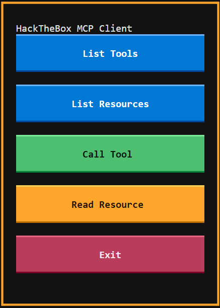

# HackTheBox MCP Client

[](https://www.python.org/downloads/)
[](https://opensource.org/licenses/MIT)
[](https://github.com/therealfredp3d/HTB-MCP-Client)

A **Textual TUI** (Terminal User Interface) client for the HackTheBox Model Context Protocol (MCP) server. Browse CTF events and challenges, execute tools, and manage resources with a sleek, interactive terminal interface.



## ✨ Features

- 🖥️ **Rich TUI Interface** - Built with Textual for a modern terminal experience
- 🎯 **Event & Challenge Selection** - Browse and select CTF events and challenges with split-panel views
- 🔧 **Tool Execution** - Execute HackTheBox MCP tools with guided argument input
- 📊 **Data Tables** - View tools, resources, and arguments in organized tables
- 💾 **Export Functionality** - Save results to JSON or Markdown files
- 🎨 **Hacker Theme** - Green-on-black aesthetic with typewriter animations
- ⚡ **Auto-fill** - Automatically populate tool arguments from selected events/challenges
- 🔄 **State Management** - Persistent selection across screens
- 📖 **Resource Management** - Read and browse MCP resources

## 📋 Prerequisites

- **Python 3.10 or later**
- HackTheBox API access token (JWT)

## 🚀 Installation

### 1. Clone the repository

```bash
git clone https://github.com/therealfredp3d/HTB-MCP-Client.git
cd HTB-MCP-Client
```

### 2. Install dependencies

Using `pip`:

```bash
pip install -r requirements.txt
```

Or using `uv` for faster installation:

```bash
uv pip install -r requirements.txt
```

### 3. Configure your API token

Create a `.env` file from the template:

```bash
cp .env.example .env
```

Edit `.env` and add your HackTheBox API token:

```env
API_ACCESS_TOKEN=your-hackthebox-jwt-token-here
```

> **Tip**: You can find your API token in the `.mcp.json` file or generate a new one from your HackTheBox profile settings.

## 💻 Usage

### Run the TUI Client

```bash
python htb_mcp_client.py
```

### Check Version

```bash
python htb_mcp_client.py --version
```

## 🎮 TUI Interface Guide

### Main Menu

The main menu provides quick access to all major features:

- **List Tools** - View all available MCP tools
- **List Resources** - Browse MCP resources
- **Challenges** - Access stored challenge data
- **Call Tool** - Execute a tool with custom arguments
- **Read Resource** - Fetch a resource by URI
- **Exit** - Close the application

### Navigating Screens

- **Arrow Keys** - Navigate lists and tables
- **Enter** - Select an item
- **Tab** - Move between UI elements
- **q** - Quit application (global binding)
- **d** - Toggle dark mode

### Event Selection

When you list CTF events:

1. Left panel shows Event IDs and Names
2. Right panel displays detailed event information in Markdown
3. Navigate with ↑/↓ arrow keys
4. Press **Enter** or click "Select Event" to store the event
5. Selected event appears in the main menu title

### Challenge Selection

Similar to event selection:

1. Browse challenges in a table (ID, Name, Difficulty, Points)
2. View detailed challenge info in the right panel
3. Select a challenge to auto-populate tool arguments

### Tool Execution

1. Select a tool from the dropdown
2. View the argument schema in a table
3. Edit the JSON arguments (pre-filled template provided)
4. Click "Execute" to run the tool
5. Results appear with typewriter animation
6. Save results as JSON or Markdown

### Exporting Data

All result screens offer export options:

- **Save to .json** - Full data structure with timestamp
- **Save to .md** - Formatted Markdown output

Files are saved to `htb_mcp_output/` directory.

## 📦 Project Structure

```
HTB-MCP-Client/
├── htb_mcp_client.py    # Main TUI application
├── requirements.txt     # Python dependencies
├── .env.example         # Environment template
├── LICENSE              # MIT License
├── CHANGELOG.md         # Version history
├── README.md           # This file
└── htb_mcp_output/     # Output directory (created automatically)
```

## 🛠️ Development

### Package the Project

```bash
pip install build
python -m build
```

### Install in Development Mode

```bash
pip install -e .
```

## 📝 Configuration

The client supports configuration via environment variables or `.env` file:

| Variable | Required | Default | Description |
|----------|----------|---------|-------------|
| `API_ACCESS_TOKEN` | **Yes** | - | Your HackTheBox API JWT token |
| `HTB_MCP_URL` | No | `https://mcp.hackthebox.ai/v1/ctf/mcp/` | MCP server endpoint |

## 🐛 Troubleshooting

### "API_ACCESS_TOKEN not set" Error

Make sure you've created a `.env` file with your token:

```bash
cp .env.example .env
# Edit .env and add your token
```

### Connection Issues

Verify your token is valid and not expired. You can generate a new token from your HackTheBox profile settings.

### Module Import Errors

Ensure all dependencies are installed:

```bash
pip install -r requirements.txt
```

## 🤝 Contributing

Contributions are welcome! Please feel free to submit a Pull Request.

1. Fork the repository
2. Create your feature branch (`git checkout -b feature/AmazingFeature`)
3. Commit your changes (`git commit -m 'Add some AmazingFeature'`)
4. Push to the branch (`git push origin feature/AmazingFeature`)
5. Open a Pull Request

## 📄 License

This project is licensed under the MIT License - see the [LICENSE](LICENSE) file for details.

## 🙏 Acknowledgments

- Built with [Textual](https://github.com/Textualize/textual) - amazing TUI framework
- Powered by [HackTheBox MCP](https://www.hackthebox.com/) API
- MCP SDK by [Anthropic](https://github.com/modelcontextprotocol/)

## 📚 Related Projects

- [HackTheBox](https://www.hackthebox.com/) - Cybersecurity training platform
- [Model Context Protocol](https://modelcontextprotocol.io/) - Standardized AI-app integration

## 🔗 Links

- [GitHub Repository](https://github.com/therealfredp3d/HTB-MCP-Client)
- [Issue Tracker](https://github.com/therealfredp3d/HTB-MCP-Client/issues)
- [HackTheBox Platform](https://www.hackthebox.com/)

---

**Made with ❤️ by Fred P3D**
