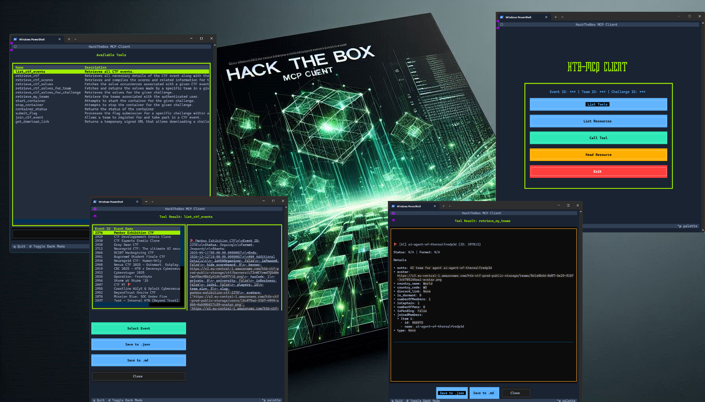

# HackTheBox MCP Client



[](https://www.python.org/downloads/)
[](https://opensource.org/licenses/MIT)

A **Textual TUI** (Terminal User Interface) client for the HackTheBox Model Context Protocol (MCP) server.

## 🚀 Intended Workflow

The client is designed to guide you through a typical CTF session:

1.  **Select Event**: Browse and select the active CTF event.
2.  **Select Team**: Identify which team you are playing with.
3.  **Select Challenge**: Browse challenges within that event.
4.  **Play Page**: Access the dedicated play screen to:
    *   Start/Stop challenge containers.
    *   Download challenge files.
    *   View challenge details and status.

```text
[ Main Menu ]
      |
      v
1. Select Event ----> [ Event List ]
      |                      |
      v                      v
2. Select Team -----> [ Team List ]
      |                      |
      v                      v
3. Select Challenge -> [ Challenge List ]
      |                      |
      v                      v
[ GO TO PLAY PAGE ] <---------/
      |
      +--> Start Container
      +--> Download Files
      +--> Stop Container
```

## ✨ Features

- 🖥️ **Guided Workflow** - Clear steps from event selection to play mode.
- 🐳 **Play Page** - Dedicated interface for container management and file downloads.
- ⚡ **Real-time Tool Schemas** - Dynamically fetches tool arguments from the MCP server.
- 📊 **Rich Data Tables** - Category names, difficulty, and solved status at a glance.
- 💾 **Markdown Export** - Save entire challenge/event lists to Markdown.
- 🎨 **Hacker Theme** - Native Textual rendering with green-on-black aesthetic.
- 🔄 **State Persistence** - Remembers your selections across screens.

## 📋 Installation & Usage

Refer to [PROJECT_OVERVIEW.md](PROJECT_OVERVIEW.md) for detailed installation and usage instructions.

## 🤝 Contributing

See [CONTRIBUTING.md](CONTRIBUTING.md) for details on how to contribute.

## 📄 License

This project is licensed under the MIT License.
