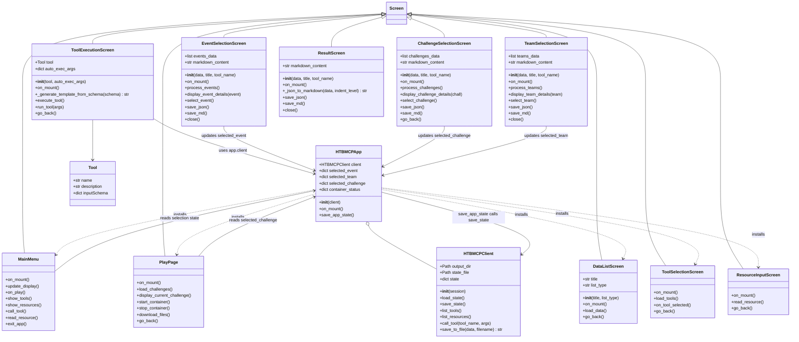

```mermaid

classDiagram
  class HTBMCPClient {
    +Path output_dir
    +Path state_file
    +dict state
    +__init__(session)
    +load_state()
    +save_state()
    +list_tools()
    +list_resources()
    +call_tool(tool_name, args)
    +save_to_file(data, filename) str
  }

  class HTBMCPApp {
    +HTBMCPClient client
    +dict selected_event
    +dict selected_team
    +dict selected_challenge
    +dict container_status
    +__init__(client)
    +on_mount()
    +save_app_state()
  }

  class MainMenu {
    +on_mount()
    +update_display()
    +on_play()
    +show_tools()
    +show_resources()
    +call_tool()
    +read_resource()
    +exit_app()
  }

  class PlayPage {
    +on_mount()
    +load_challenges()
    +display_current_challenge()
    +start_container()
    +stop_container()
    +download_files()
    +go_back()
  }

  class ToolExecutionScreen {
    +Tool tool
    +dict auto_exec_args
    +__init__(tool, auto_exec_args)
    +on_mount()
    +_generate_template_from_schema(schema) str
    +execute_tool()
    +run_tool(args)
    +go_back()
  }

  class EventSelectionScreen {
    +list events_data
    +str markdown_content
    +__init__(data, title, tool_name)
    +on_mount()
    +process_events()
    +display_event_details(event)
    +select_event()
    +save_json()
    +save_md()
    +close()
  }

  class ChallengeSelectionScreen {
    +list challenges_data
    +str markdown_content
    +__init__(data, title, tool_name)
    +on_mount()
    +process_challenges()
    +display_challenge_details(chall)
    +select_challenge()
    +save_json()
    +save_md()
    +go_back()
  }

  class TeamSelectionScreen {
    +list teams_data
    +str markdown_content
    +__init__(data, title, tool_name)
    +on_mount()
    +process_teams()
    +display_team_details(team)
    +select_team()
    +save_json()
    +save_md()
    +close()
  }

  class ResultScreen {
    +str markdown_content
    +__init__(data, title, tool_name)
    +on_mount()
    +_json_to_markdown(data, indent_level) str
    +save_json()
    +save_md()
    +close()
  }

  class DataListScreen {
    +str title
    +str list_type
    +__init__(title, list_type)
    +on_mount()
    +load_data()
    +go_back()
  }

  class ToolSelectionScreen {
    +on_mount()
    +load_tools()
    +on_tool_selected()
    +go_back()
  }

  class ResourceInputScreen {
    +on_mount()
    +read_resource()
    +go_back()
  }

  class Tool {
    +str name
    +str description
    +dict inputSchema
  }

  class Screen

  HTBMCPApp o-- HTBMCPClient

  Screen <|-- MainMenu
  Screen <|-- PlayPage
  Screen <|-- ToolExecutionScreen
  Screen <|-- EventSelectionScreen
  Screen <|-- ChallengeSelectionScreen
  Screen <|-- TeamSelectionScreen
  Screen <|-- ResultScreen
  Screen <|-- DataListScreen
  Screen <|-- ToolSelectionScreen
  Screen <|-- ResourceInputScreen

  HTBMCPApp ..> MainMenu : installs
  HTBMCPApp ..> PlayPage : installs
  HTBMCPApp ..> DataListScreen : installs
  HTBMCPApp ..> ToolSelectionScreen : installs
  HTBMCPApp ..> ResourceInputScreen : installs

  ToolExecutionScreen --> HTBMCPApp : uses app.client
  EventSelectionScreen --> HTBMCPApp : updates selected_event
  ChallengeSelectionScreen --> HTBMCPApp : updates selected_challenge
  TeamSelectionScreen --> HTBMCPApp : updates selected_team

  MainMenu --> HTBMCPApp : reads selection state
  PlayPage --> HTBMCPApp : reads selected_challenge
  HTBMCPApp --> HTBMCPClient : save_app_state calls save_state

  ToolExecutionScreen --> Tool
```
