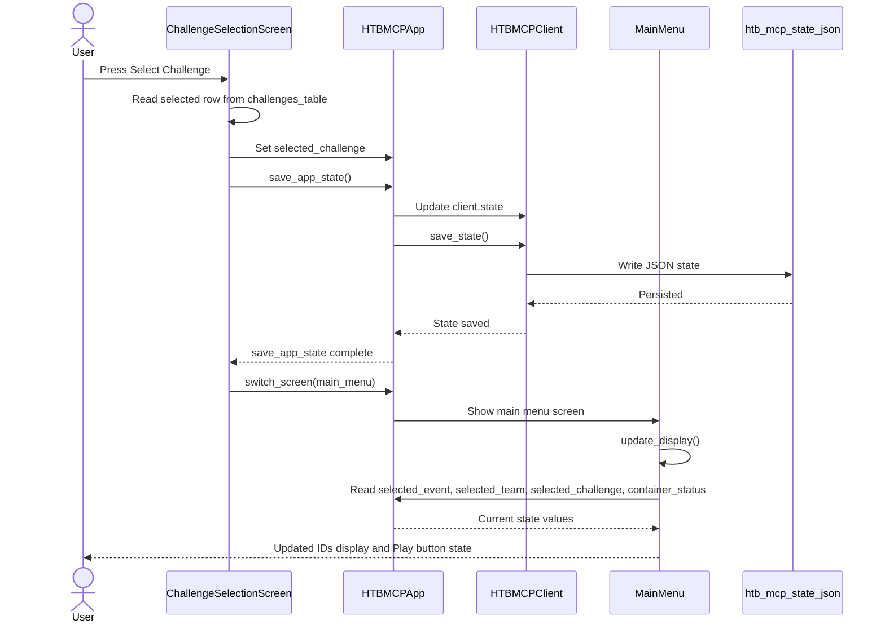

```mermaid
sequenceDiagram
  actor User
  participant ChallengeSelectionScreen
  participant HTBMCPApp
  participant HTBMCPClient
  participant MainMenu
  participant StateFile as htb_mcp_state_json

  User->>ChallengeSelectionScreen: Press Select Challenge
  ChallengeSelectionScreen->>ChallengeSelectionScreen: Read selected row from challenges_table
  ChallengeSelectionScreen->>HTBMCPApp: Set selected_challenge
  ChallengeSelectionScreen->>HTBMCPApp: save_app_state()
  HTBMCPApp->>HTBMCPClient: Update client.state
  HTBMCPApp->>HTBMCPClient: save_state()
  HTBMCPClient->>StateFile: Write JSON state
  StateFile-->>HTBMCPClient: Persisted
  HTBMCPClient-->>HTBMCPApp: State saved
  HTBMCPApp-->>ChallengeSelectionScreen: save_app_state complete

  ChallengeSelectionScreen->>HTBMCPApp: switch_screen(main_menu)
  HTBMCPApp->>MainMenu: Show main menu screen
  MainMenu->>MainMenu: update_display()
  MainMenu->>HTBMCPApp: Read selected_event, selected_team, selected_challenge, container_status
  HTBMCPApp-->>MainMenu: Current state values
  MainMenu-->>User: Updated IDs display and Play button state
```
